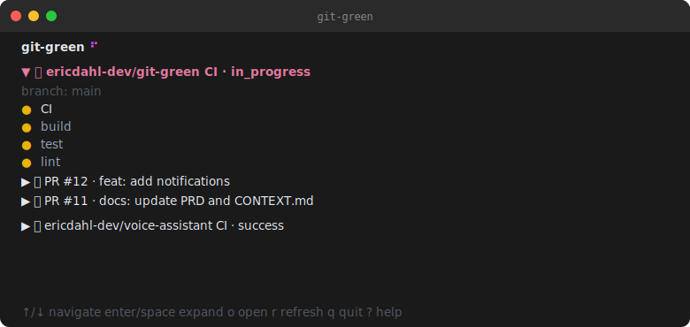

# git-green

A terminal dashboard for live GitHub CI health across multiple repos — no browser required.



## Features

- **Stoplight-per-repo** — 🟢 🔴 🟡 ⚪ aggregated worst-case across all workflows
- **PR-level CI tree** — expand any repo to see branch CI and each open PR with its own stoplight
- **Active-first sorting** — in-progress and failing repos/PRs bubble to the top automatically
- **Inline expand/collapse** — navigate with `↑`/`↓`, toggle any row with `enter`/`space`
- **Auto-polling** — refreshes every 15 seconds (configurable); retains last-known status on API errors
- **Multi-org** — per-org token config with `gh auth token` fallback
- **Single binary** — no runtime, no dependencies

## Install

```bash
go install github.com/ericdahl-dev/git-green@latest
```

## Config

Create `~/.config/git-green/config.toml`:

```toml
[settings]
poll_interval = 15  # seconds

[[orgs]]
name = "your-org"
token = "ghp_xxx"          # or token_env = "MY_TOKEN_ENV"

[[repos]]
owner = "your-org"
name = "your-repo"
# branch = "main"          # optional; defaults to repo default branch
# workflows = ["CI"]       # optional; defaults to all workflows
```

### Personal account repos

To monitor repos in your personal GitHub account, use your GitHub username as `owner`. No `[[orgs]]` entry is required — git-green falls back to `gh auth token` automatically:

```toml
[[repos]]
owner = "your-github-username"
name = "your-repo"
```

If you want to use an explicit token for your personal repos, add an `[[orgs]]` entry with your username as the `name`:

```toml
[[orgs]]
name = "your-github-username"
token = "ghp_xxx"

[[repos]]
owner = "your-github-username"
name = "your-repo"
```

## Keybindings

| Key | Action |
|---|---|
| `↑` / `k` | Navigate up |
| `↓` / `j` | Navigate down |
| `enter` / `space` | Expand / collapse repo or PR row |
| `r` | Force refresh |
| `o` | Open run in browser |
| `q` | Quit |
| `?` | Help overlay |
