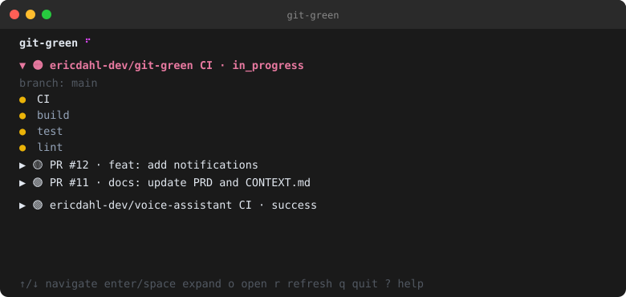

# git-green

### git your branches green

A terminal dashboard for live GitHub CI health across multiple repos — no browser required.



## Features

- **Stoplight-per-repo** — 🟢 🔴 🟡 ⚪ aggregated worst-case across all workflows
- **PR-level CI tree** — expand any repo to see branch CI and each open PR with its own stoplight
- **Stacked PRs grouped** — PRs in a `gh stack` stack collapse into one row that shows the stack number, its health, and each member in merge order
- **Active-first sorting** — in-progress and failing repos/PRs bubble to the top automatically
- **Inline expand/collapse** — navigate with `↑`/`↓`, toggle any row with `enter`/`space`
- **Auto-polling** — refreshes every 15 seconds (configurable); retains last-known status on API errors
- **Adaptive pacing** — watches each token's GitHub REST budget and stretches the poll interval only as far as it must to last the hour, keeping a reserve for your other tools
- **In-TUI repo management** — add, edit, delete, and enable/disable repos without leaving the terminal
- **Multi-org** — per-org token config with `gh auth token` fallback
- **Single binary** — no runtime, no dependencies
- **Interactive init** — `git-green init` writes a starter config via a terminal form

## Install

### Homebrew

```bash
brew install ericdahl-dev/tap/git-green
```

As of v0.2.0, git-green is published as a Homebrew **cask** rather than a formula — GoReleaser removed the formula config this project used. New installs need no change. If you installed before v0.2.0 you are on the old formula, which is frozen and no longer receives updates; move across once with:

```bash
brew uninstall git-green
brew install --cask ericdahl-dev/tap/git-green
```

### Go

```bash
go install github.com/ericdahl-dev/git-green@latest
```

## Usage

```bash
git-green            # launch the dashboard
git-green init       # write a starter config
git-green --version  # print the version
git-green --help     # show usage
```

## First-time config

Run an interactive wizard (writes `~/.config/git-green/config.toml`):

```bash
git-green init
```

Use `git-green init --force` to overwrite an existing file.

## Config

Create `~/.config/git-green/config.toml` by hand, or start from `git-green init` and edit:

```toml
[settings]
poll_interval_seconds = 15
# stuck_threshold_minutes = 30   # optional; default 30

[[orgs]]
name = "your-org"
token = "ghp_xxx"          # or token_env = "MY_TOKEN_ENV"

[[repos]]
owner = "your-org"
name = "your-repo"
# branch = "main"          # optional; defaults to repo default branch
# workflows = ["CI"]       # optional; defaults to all workflows
# enabled = false          # optional; disable without deleting (no API calls made)
```

### Personal accounts and orgs without a token

Any `owner` that doesn't match a `[[orgs]]` entry automatically falls back to `gh auth token` — the account you're logged in as via `gh auth login`. No extra config needed:

```toml
# Logged in as Skeyelab via `gh auth login`? Just add the repo:
[[repos]]
owner = "Skeyelab"
name = "your-repo"
```

To use an explicit token for a specific account, add an `[[orgs]]` entry:

```toml
[[orgs]]
name = "some-other-org"
token_env = "SOME_ORG_TOKEN"   # or token = "ghp_xxx"

[[repos]]
owner = "some-other-org"
name = "your-repo"
```

## Stuck alerts

git-green POSTs a JSON event to each configured webhook when a branch or PR has
been failing, stuck in progress, or conflicting for longer than
`stuck_threshold_minutes` (default `30`):

```toml
[[webhooks]]
url = "https://hooks.example.com/git-green"
# secret = "shared-secret"   # optional; enables request signing
```

```json
{
  "event": "branch_stuck",
  "reason": "prolonged_failure",
  "repo": "your-org/your-repo",
  "workflow": "CI",
  "run_url": "https://github.com/your-org/your-repo/actions/runs/123",
  "stuck_since": "2026-08-26T09:00:00Z",
  "timestamp": "2026-08-26T09:31:00Z"
}
```

`event` is `branch_stuck` or `pr_stuck`; `reason` is `prolonged_failure`,
`prolonged_in_progress`, or `conflict`. A `pr_stuck` event also carries a `pr`
object with `number`, `title`, and `url`.

Each condition alerts **once**, on the first poll after it crosses the
threshold — not on every cycle. Recovering re-arms it, so a repo that breaks
again later alerts again. `stuck_since` is when the condition started, not when
the alert fired.

When a webhook has a `secret`, the request is signed with HMAC-SHA256 over the
raw body and sent as `X-Git-Green-Signature: sha256=<hex>`.

## Keybindings

### Dashboard

| Key | Action |
|---|---|
| `↑` / `k` | Navigate up |
| `↓` / `j` | Navigate down |
| `enter` / `space` | Expand / collapse repo, stack, or PR row |
| `f` | Re-run the failed run on the selected row (`enter` confirms, `esc` cancels) |
| `r` | Force refresh |
| `o` | Open run in browser |
| `m` | Open repo manager |
| `q` | Quit |
| `?` | Toggle help overlay |
| `esc` | Close help overlay |

`f` is the only key that writes to GitHub. It calls `rerun-failed-jobs` for the
run, falling back to re-running the whole run when there are no individually
failed jobs, so the token for that org needs `actions: write`. A read-only token
gets a 403 and the error is shown in the footer.

### Repo manager (`m`)

| Key | Action |
|---|---|
| `↑` / `k` | Navigate up |
| `↓` / `j` | Navigate down |
| `t` / `space` | Toggle enable / disable |
| `a` | Add repo |
| `e` | Edit repo |
| `d` | Delete repo |
| `esc` | Back to dashboard |

Changes are written to `config.toml` immediately and the poller reloads automatically. Disabled repos make no API calls.

## Troubleshooting

Set `GIT_GREEN_DEBUG=1` to print per-repo fetch debug lines to stderr.
